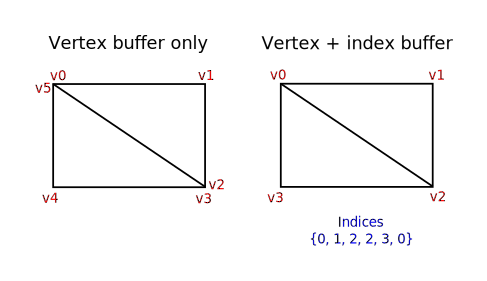

# VulkanMore

## Vertex buffers 顶点缓冲区

### Vertex input description 顶点输入描述

#### Introduction 引言

在接下来的几章中，我们将用内存中的顶点缓冲区替换顶点着色器中硬编码的顶点数据。我们将从最简单的方法开始，创建一个 CPU 可见缓冲区，并使用 `memcpy` 直接将顶点数据复制到它，然后我们将看到如何使用分级缓冲区将顶点数据复制到高性能内存.

#### Vertex shader 顶点着色器

首先将顶点着色器更改为不再包含着色器代码本身中的顶点数据。顶点着色器使用 in 关键字从顶点缓冲区获取输入。

```cpp
#version 450

layout(location = 0) in vec2 inPosition;
layout(location = 1) in vec3 inColor;

layout(location = 0) out vec3 fragColor;


void main() {
    gl_Position = vec4(inPosition, 0.0, 1.0);
    fragColor = inColor;
}
```

`inPosition` 和 `inColor` 变量是顶点属性。它们是在顶点缓冲区中为每个顶点指定的属性，就像我们使用两个数组手动指定每个顶点的位置和颜色一样。确保重新编译顶点着色器！

就像 `fragColor` 一样，`layout(location = x)`注释为输入分配索引，我们以后可以使用这些索引来引用它们。重要的是要知道，有些类型，如 dvec3 64位向量，使用多个插槽。这意味着，其后的指数必须至少高出2:

```cpp
layout(location = 0) in dvec3 inPosition;
layout(location = 2) in vec3 inColor;
```

你可以在 OpenGL wiki 中找到关于布局限定符的更多信息。

#### Vertex data 顶点数据

我们将顶点数据从着色器代码移动到程序代码中的数组中。首先包括 GLM 库，它为我们提供了与线性代数相关的类型，如向量和矩阵。我们将使用这些类型来指定位置和颜色矢量。

```cpp
#include <glm/glm.hpp>
```

创建一个新的结构称为顶点与两个属性，我们将在顶点着色器内使用它:

```cpp
struct Vertex {
    glm::vec2 pos;
    glm::vec3 color;
};
```

GLM 为我们提供了与着色器语言中使用的向量类型完全匹配的 C++ 类型。

```cpp
const std::vector<Vertex> vertices = {
    {{0.0f, -0.5f}, {1.0f, 0.0f, 0.0f}},
    {{0.5f, 0.5f}, {0.0f, 1.0f, 0.0f}},
    {{-0.5f, 0.5f}, {0.0f, 0.0f, 1.0f}}
};
```

现在使用 `Vertex` 结构来指定顶点数据数组。我们使用了与以前完全相同的位置和颜色值，但是现在它们被组合成一个顶点数组。这就是所谓的交错顶点属性。

#### Binding descriptions 绑定描述

下一步是告诉 Vulkan 如何传递这个数据格式到顶点着色器，一旦它被上传到 GPU 内存。需要两种类型的结构来传达这种信息。

第一个结构是 `VkVertexInputBindingDescription`，我们将向 Vertex 结构添加一个成员函数，用正确的数据填充它

```cpp
struct Vertex {
    glm::vec2 pos;
    glm::vec3 color;

    static VkVertexInputBindingDescription getBindingDescription() {
        VkVertexInputBindingDescription bindingDescription{};

        return bindingDescription;
    }
};
```

顶点绑定描述了以何种速率从内存中加载整个顶点的数据。它指定数据条目之间的字节数，以及是在每个顶点之后还是在每个实例之后移动到下一个数据条目。

```cpp
VkVertexInputBindingDescription bindingDescription{};
bindingDescription.binding = 0;
bindingDescription.stride = sizeof(Vertex);
bindingDescription.inputRate = VK_VERTEX_INPUT_RATE_VERTEX;
```

我们所有的每个顶点数据都打包在一个数组中，所以我们只有一个绑定。`binding` 参数指定绑定数组中绑定的索引。`stride` 参数指定从一个条目到下一个条目的字节数，`inputRate` 参数可以有以下值之一:

- `VK_VERTEX_INPUT_RATE_VERTEX` 每个顶点后的移动到下一个数据条目
- `VK_VERTEX_INPUT_RATE_INSTANCE` 在每个实例之后移动到下一个数据条目

我们不打算使用实例渲染，所以我们将坚持使用每个顶点的数据。

#### Attribute descriptions 属性描述

描述如何处理顶点输入的第二个结构是 `VkVertexInputAttributeDescription`。我们将向 `Vertex` 添加另一个辅助函数来填充这些结构。

```cpp
#include <array>

...

static std::array<VkVertexInputAttributeDescription, 2> getAttributeDescriptions() {
    std::array<VkVertexInputAttributeDescription, 2> attributeDescriptions{};

    return attributeDescriptions;
}
```

正如函数原型所指出的，将会有两个这样的结构。属性描述结构描述如何从来自绑定描述的顶点数据块中提取顶点属性。我们有两个属性，位置和颜色，所以我们需要两个属性描述结构。

```cpp
attributeDescriptions[0].binding = 0;
attributeDescriptions[0].location = 0;
attributeDescriptions[0].format = VK_FORMAT_R32G32_SFLOAT;
attributeDescriptions[0].offset = offsetof(Vertex, pos);
```

`binding`参数告诉 Vulkan 绑定每个顶点数据的来源。`location`参数引用顶点着色器中输入的`location`指令。位置为0的顶点着色器中的输入是位置，它有两个32位浮动分量。

Format 参数描述属性的数据类型。有点令人困惑的是，这些格式使用与颜色格式相同的枚举来指定。下列着色器类型和格式通常一起使用:

- `float`: `VK_FORMAT_R32_SFLOAT`
- `vec2`: `VK_FORMAT_R32G32_SFLOAT`
- `vec3`: `VK_FORMAT_R32G32B32_SFLOAT`
- `vec4`: `VK_FORMAT_R32G32B32A32_SFLOAT`

如您所见，您应该使用颜色通道数量与着色器数据类型中的组件数量相匹配的格式。它允许使用比着色器中的组件数量更多的通道，但是它们将被无声地丢弃。如果通道数低于组件数，那么 BGA 组件将使用默认值`(0,0,1)`。颜色类型(`SFLOAT`,`UINT`, `SINT`)和位宽度也应该匹配着色器输入的类型。请看下面的例子:

- `ivec2`: `VK_FORMAT_R32G32_SINT`, a 2-component vector of 32-bit signed integers 一个由32位有符号整数组成的2分量向量
- `uvec4`: `VK_FORMAT_R32G32B32A32_UINT`, a 4-component vector of 32-bit unsigned integers 一个由32位无符号整数组成的4分量向量
- `double`: `VK_FORMAT_R64_SFLOAT`, a double-precision (64-bit) float ，双精度(64位)浮点

`Format` 参数隐式定义属性数据的字节大小，而 `offset` 参数指定从每个顶点数据开始读取的字节数。此次定义的绑定每次加载一个顶点，位置属性(pos)从这个结构的开始处偏移0字节。这里使用`offsetof`宏的自动计算偏移量自动计算。

```cpp
attributeDescriptions[1].binding = 0;
attributeDescriptions[1].location = 1;
attributeDescriptions[1].format = VK_FORMAT_R32G32B32_SFLOAT;
attributeDescriptions[1].offset = offsetof(Vertex, color);
```

颜色属性的描述方式大致相同

#### Pipeline vertex input 管道顶点输入

我们现在需要设置渲染管线接受这种格式的顶点数据，方法是引用 `createGraphicsPipeline` 中的结构。找到 `vertexInputInfo` 结构并修改它以引用以下两个描述:

```cpp
auto bindingDescription = Vertex::getBindingDescription();
auto attributeDescriptions = Vertex::getAttributeDescriptions();

vertexInputInfo.vertexBindingDescriptionCount = 1;
vertexInputInfo.vertexAttributeDescriptionCount = static_cast<uint32_t>(attributeDescriptions.size());
vertexInputInfo.pVertexBindingDescriptions = &bindingDescription;
vertexInputInfo.pVertexAttributeDescriptions = attributeDescriptions.data();
```

管道现在可以接受顶点容器格式的顶点数据，并将其传递给顶点着色器。如果您现在在启用验证层的情况下运行程序，您将看到它提示没有顶点缓冲区绑定到绑定上。下一步是创建一个顶点缓冲区，并将顶点数据移动到它上面，这样 GPU 就可以访问它。

### Vertex buffer creation 创建顶点缓冲区

#### Introduction 创建顶点缓冲区引言

Vulkan 中的缓冲区是用于存储可由显卡读取的任意数据的内存区域。它们可以用来存储顶点数据，这一点我们将在本章中讨论，但它们也可以用于许多其他目的，我们将在以后的章节中探讨。与我们到目前为止处理的 Vulkan 对象不同，缓冲区不会自动为自己分配内存。前面章节的工作已经表明 Vulkan API 使程序员控制几乎所有事情，内存管理就是其中之一。

#### Buffer creation 创建缓冲区

创建一个新函数 `createVertexBuffer`，并在 `createCommandBuffers` 之前从 `initVulkan` 调用它。

```cpp
void initVulkan() {
    createInstance();
    setupDebugMessenger();
    createSurface();
    pickPhysicalDevice();
    createLogicalDevice();
    createSwapChain();
    createImageViews();
    createRenderPass();
    createGraphicsPipeline();
    createFramebuffers();
    createCommandPool();
    createVertexBuffer();
    createCommandBuffers();
    createSyncObjects();
}

...

void createVertexBuffer() {

}
```

创建缓冲区需要填充 `VkBufferCreateInfo` 结构。

```cpp
VkBufferCreateInfo bufferInfo{};
bufferInfo.sType = VK_STRUCTURE_TYPE_BUFFER_CREATE_INFO;
bufferInfo.size = sizeof(vertices[0]) * vertices.size();
```

这个结构的第一个字段是 `size`，它以字节为单位指定缓冲区的大小。使用 `sizeof` 可以直接计算顶点数据的字节大小。

```cpp
bufferInfo.usage = VK_BUFFER_USAGE_VERTEX_BUFFER_BIT;
```

第二个字段是 `usage`，它指示缓冲区中的数据将用于何种目的。可以使用位或。我们的用例将是一个顶点缓冲区，我们将在以后的章节中研究其他类型的用法。

```cpp
bufferInfo.sharingMode = VK_SHARING_MODE_EXCLUSIVE;
```

就像交换链中的映像一样，缓冲区也可以由特定的队列家族拥有，或者同时在多个队列之间共享。缓冲区将只用于图形队列，因此我们可以坚持独占访问。

`flags` 参数用于配置稀疏缓冲区内存，这一点目前并不重要。我们将它保留在默认值0。

我们现在可以使用 `vkCreateBuffer` 创建缓冲区。定义一个类成员来保存缓冲区句柄并称之为 `vertexBuffer`。

```cpp
VkBuffer vertexBuffer;

...

void createVertexBuffer() {
    VkBufferCreateInfo bufferInfo{};
    bufferInfo.sType = VK_STRUCTURE_TYPE_BUFFER_CREATE_INFO;
    bufferInfo.size = sizeof(vertices[0]) * vertices.size();
    bufferInfo.usage = VK_BUFFER_USAGE_VERTEX_BUFFER_BIT;
    bufferInfo.sharingMode = VK_SHARING_MODE_EXCLUSIVE;

    if (vkCreateBuffer(device, &bufferInfo, nullptr, &vertexBuffer) != VK_SUCCESS) {
        throw std::runtime_error("failed to create vertex buffer!");
    }
}
```

缓冲区应该可以在渲染命令中使用，直到程序结束，并且它不依赖于交换链，所以我们将在原始的`cleanup`函数中清理它:

```cpp
void cleanup() {
    cleanupSwapChain();

    vkDestroyBuffer(device, vertexBuffer, nullptr);

    ...
}
```

#### Memory requirements 内存需求

缓冲区已经被创建，但是它实际上还没有分配给它任何内存。为缓冲区分配内存的第一步是使用名为 `vkGetBufferMemoryRequirements` 的函数查询其内存需求。

```cpp
VkMemoryRequirements memRequirements;
vkGetBufferMemoryRequirements(device, vertexBuffer, &memRequirements);
```

`VkMemoryRequirements` 结构有三个字段:

- `size`: 所需内存量的大小(以字节为单位)可能与`bufferInfo.size`不同.
- `alignment`: 缓冲区在分配的内存区域开始时的字节偏移量，取决于`bufferInfo.usage` 及 `bufferInfo.flags`.
- `memoryTypeBits`: 适合于缓冲区的内存类型的位字段

显卡可以提供不同类型的内存来分配。每种类型的内存根据允许的操作和性能特征而变化。我们需要结合缓冲区的需求和我们自己的应用程序需求来找到正确的内存类型来使用。让我们为此创建一个新函数 `findMemoryType`。

```cpp
uint32_t findMemoryType(uint32_t typeFilter, VkMemoryPropertyFlags properties) {

}
```

首先，我们需要使用 `vkGetPhysicalDeviceMemoryProperties` 查询关于可用内存类型的信息

```cpp
VkPhysicalDeviceMemoryProperties memProperties;
vkGetPhysicalDeviceMemoryProperties(physicalDevice, &memProperties);
```

`Vkphysicaldevicemoryproperties` 结构有两个数组 `memoryTypes` 和 `memoryHeaps`。内存堆是不同的内存资源，比如专用的 VRAM 和当 VRAM 用完时在 RAM 中的交换空间。这些堆中存在不同类型的内存。现在我们只关心内存的类型，而不是它来自哪个堆，但是您可以想象这会影响性能。

让我们首先找到一个适合缓冲区本身的内存类型:

```cpp
for (uint32_t i = 0; i < memProperties.memoryTypeCount; i++) {
    if (typeFilter & (1 << i)) {
        return i;
    }
}

throw std::runtime_error("failed to find suitable memory type!");
```

`typeFilter` 参数将用于指定适当的内存类型的位字段。这意味着我们可以通过简单的迭代找到一个合适的内存类型的索引，并检查相应的位是否设置为1。

然而，我们不仅仅对适合于顶点缓冲区的内存类型感兴趣。我们还需要能够写入我们的顶点数据的内存。`memoryTypes` 数组由 `VkMemoryType` 结构组成，这些结构指定了堆和每种类型内存的属性。这些属性定义了内存的特殊功能，比如能够映射内存，这样我们就可以从 CPU 写入内存。这个属性是用 `VK_MEMORY_PROPERTY_HOST_VISIBLE_BIT` 表示的，但是我们也需要使用 `VK_MEMORY_PROPERTY_HOST_COHERENT_BIT` 属性。当我们映射内存的时候，我们就知道为什么了。

我们现在可以修改循环来检查是否支持这个属性:

```cpp
for (uint32_t i = 0; i < memProperties.memoryTypeCount; i++) {
    if ((typeFilter & (1 << i)) && (memProperties.memoryTypes[i].propertyFlags & properties) == properties) {
        return i;
    }
}
```

我们可能有不止一个理想的属性，所以我们应该检查位 AND 的结果是否不仅仅是非零，而是等于所需的属性位字段。如果存在一个适合缓冲区的内存类型，并且该内存类型也具有我们需要的所有属性，那么我们将返回它的索引，否则我们将抛出一个异常。

#### Memory allocation 内存分配

现在我们有了一种确定正确内存类型的方法，因此我们实际上可以通过填充 `VkMemoryAllocateInfo` 结构来分配内存。

```cpp
VkMemoryAllocateInfo allocInfo{};
allocInfo.sType = VK_STRUCTURE_TYPE_MEMORY_ALLOCATE_INFO;
allocInfo.allocationSize = memRequirements.size;
allocInfo.memoryTypeIndex = findMemoryType(memRequirements.memoryTypeBits, VK_MEMORY_PROPERTY_HOST_VISIBLE_BIT | VK_MEMORY_PROPERTY_HOST_COHERENT_BIT);
```

内存分配现在就像指定大小和类型一样简单，这两者都是从顶点缓冲区的内存需求和期望的属性中派生出来的。创建一个类成员将句柄存储到内存中，并用 `vkAllocateMemory` 分配它。

```cpp
VkBuffer vertexBuffer;
VkDeviceMemory vertexBufferMemory;

...

if (vkAllocateMemory(device, &allocInfo, nullptr, &vertexBufferMemory) != VK_SUCCESS) {
    throw std::runtime_error("failed to allocate vertex buffer memory!");
}
```

如果内存分配成功，那么我们现在可以使用 `vkBindBufferMemory` 将这个内存与缓冲区关联起来:

```cpp
vkBindBufferMemory(device, vertexBuffer, vertexBufferMemory, 0);
```

前三个参数是不言自明的，第四个参数是内存区域内的偏移量。因为这个内存是专门为这个顶点缓冲区分配的，所以偏移量只是0。如果偏移量为非零，则需要被 `memRequirements.alignment` 整除。

当然，就像 C++ 中的动态内存分配一样，内存应该在某个时刻被释放。一旦缓冲区不再使用，绑定到缓冲区对象的内存可能会被释放，所以让我们在缓冲区被销毁后释放它:

```cpp
void cleanup() {
    cleanupSwapChain();

    vkDestroyBuffer(device, vertexBuffer, nullptr);
    vkFreeMemory(device, vertexBufferMemory, nullptr);
```

#### Filling the vertex buffer 填充顶点缓冲区

现在是将顶点数据复制到缓冲区的时候了。这是通过使用 `vkMapMemory` 将缓冲区内存映射到 CPU 可访问内存来实现的。

```cpp
void* data;
vkMapMemory(device, vertexBufferMemory, 0, bufferInfo.size, 0, &data);
```

这个函数允许我们访问由偏移量和大小定义的指定内存资源的区域。这里的偏移量和大小分别为`0`和 `bufferInfo.size`。还可以指定特殊值 `VK_WHOLE_SIZE`  来映射所有内存。倒数第二个参数可以用来指定标志，但是当前 API 中还没有任何可用的参数。它必须设置为值0。最后一个参数指定指向映射内存的指针的输出。

```cpp
void* data;
vkMapMemory(device, vertexBufferMemory, 0, bufferInfo.size, 0, &data);
memcpy(data, vertices.data(), (size_t) bufferInfo.size);
vkUnmapMemory(device, vertexBufferMemory);
```

您现在可以简单地使用 `memcpy` 将顶点数据映射到映射的内存中，然后再次使用 `vkUnmapMemory` 将其取消映射。不幸的是，驱动程序可能不会立即将数据复制到缓冲区内存中，例如，因为缓存。还有一种可能是，对缓冲区的写操作在映射的内存中还不可见。解决这个问题有两种方法:

- 使用主机一致的内存堆，用 `VK_MEMORY_PROPERTY_HOST_COHERENT_BIT`
- 在写入映射的内存后，调用 `vkInvalidateMappedMemoryRanges`,然后再从映射的内存中读取

我们采用了第一种方法，这种方法确保映射的内存始终与分配的内存的内容匹配。请记住，这可能会导致比显式刷新性能稍微差一点，但我们将在下一章中看到为什么这并不重要。

刷新内存范围或使用一致的内存堆意味着驱动程序将知道我们对缓冲区的写操作，但这并不意味着它们实际上在 GPU 上是可见的。向 GPU 传输数据是在后台进行的操作，规范只是告诉我们，在下一次调用 `vkQueueSubmit` 时，数据传输保证是完整的。

#### Binding the vertex buffer 绑定顶点缓冲区

现在剩下的就是在渲染操作期间绑定顶点缓冲区了。我们将扩展 `createCommandBuffers` 函数来做到这一点。

```cpp
vkCmdBindPipeline(commandBuffers[i], VK_PIPELINE_BIND_POINT_GRAPHICS, graphicsPipeline);

VkBuffer vertexBuffers[] = {vertexBuffer};
VkDeviceSize offsets[] = {0};
vkCmdBindVertexBuffers(commandBuffers[i], 0, 1, vertexBuffers, offsets);

vkCmdDraw(commandBuffers[i], static_cast<uint32_t>(vertices.size()), 1, 0, 0);
```

`vkCmdBindVertexBuffers` 函数用于将顶点缓冲区与绑定链接，就像我们在前一章中设置的那样。除了命令缓冲区之外，前两个参数指定我们要为其指定顶点缓冲区的偏移量和绑定数量。最后两个参数指定要绑定的顶点缓冲区数组和开始读取顶点数据的字节偏移量。您还应该更改对 `vkCmdDraw` 的调用，以传递缓冲区中的顶点数，而不是硬编码的数字3。

现在运行这个程序，你会再次看到熟悉的三角形

尝试通过修改顶点数组将顶点的颜色改为白色:

```cpp
const std::vector<Vertex> vertices = {
    {{0.0f, -0.5f}, {1.0f, 1.0f, 1.0f}},
    {{0.5f, 0.5f}, {0.0f, 1.0f, 0.0f}},
    {{-0.5f, 0.5f}, {0.0f, 0.0f, 1.0f}}
};
```

再次运行该程序，您应该会看到以下内容:


在下一章中，我们将看到一种不同的方式来复制顶点数据到一个顶点缓冲区，这将带来更好的性能，但需要更多的工作。

### Staging buffer 分级缓冲器

#### Introduction 分级缓冲器 引言

我们现在使用的顶点缓冲区可以正常工作，但是允许我们从 CPU 访问它的内存类型可能不是显卡本身可以读取的最佳内存类型。最理想的内存具有 `VK_MEMORY_PROPERTY_DEVICE_LOCAL_BIT` 标志，并且通常不能被专用显卡上的CPU访问。在本章中，我们将创建两个顶点缓冲区。CPU 可访问内存中的一个分级缓冲区，用于将顶点数组中的数据上传到设备本地内存中的最终顶点缓冲区。然后，我们将使用一个缓冲区复制命令将数据从分级缓冲器移动到实际的顶点缓冲区。

#### Transfer queue 转移队列

缓冲区复制命令需要一个支持传输操作的队列族，这是使用 `VK_QUEUE_TRANSFER_BIT`  指示的。好消息是，任何具有 `VK_QUEUE_GRAPHICS_BIT`  或 `VK_QUEUE_COMPUTE_BIT`  功能的队列族已经隐式地支持 `VK_QUEUE_TRANSFER_BIT`  操作。在这些情况下，不需要实现在 `queueFlags` 中显式列出它。

如果您喜欢挑战，那么您仍然可以尝试使用不同的队列族专门用于转移操作。它将要求您对您的程序进行以下修改:

- 修改 `QueueFamilyIndices` 及 `findQueueFamilies` 方法来显式地查找队列族`VK_QUEUE_TRANSFER_BIT` ，但不是`VK_QUEUE_GRAPHICS_BIT`
- 修改 `createLogicalDevice` 请求传输队列的句柄
- 传输队列家族中提交的命令缓冲区创建第二个命令池
- 更改 `sharingMode` 资源的数量 `VK_SHARING_MODE_CONCURRENT` 并指定图形和转移队列族
- 提交任何传输命令，如 `vkCmdCopyBuffer` (我们将在本章中使用)到传输队列，而不是图形队列

这需要做一些工作，但是它将教会您很多关于队列族之间如何共享资源的知识。

#### Abstracting buffer creation 抽象缓冲区的创建

因为我们将在本章中创建多个缓冲区，所以将缓冲区创建转移到辅助函数是一个好主意。创建一个新函数 `createBuffer`，并将 `createVertexBuffer` 中的代码(映射除外)移动到该函数。

```cpp
void createBuffer(VkDeviceSize size, VkBufferUsageFlags usage, VkMemoryPropertyFlags properties, VkBuffer& buffer, VkDeviceMemory& bufferMemory) {
    VkBufferCreateInfo bufferInfo{};
    bufferInfo.sType = VK_STRUCTURE_TYPE_BUFFER_CREATE_INFO;
    bufferInfo.size = size;
    bufferInfo.usage = usage;
    bufferInfo.sharingMode = VK_SHARING_MODE_EXCLUSIVE;

    if (vkCreateBuffer(device, &bufferInfo, nullptr, &buffer) != VK_SUCCESS) {
        throw std::runtime_error("failed to create buffer!");
    }

    VkMemoryRequirements memRequirements;
    vkGetBufferMemoryRequirements(device, buffer, &memRequirements);

    VkMemoryAllocateInfo allocInfo{};
    allocInfo.sType = VK_STRUCTURE_TYPE_MEMORY_ALLOCATE_INFO;
    allocInfo.allocationSize = memRequirements.size;
    allocInfo.memoryTypeIndex = findMemoryType(memRequirements.memoryTypeBits, properties);

    if (vkAllocateMemory(device, &allocInfo, nullptr, &bufferMemory) != VK_SUCCESS) {
        throw std::runtime_error("failed to allocate buffer memory!");
    }

    vkBindBufferMemory(device, buffer, bufferMemory, 0);
}
```

确保为缓冲区大小、内存属性和使用情况添加参数，这样我们就可以使用这个函数创建许多不同类型的缓冲区。最后两个参数是要将句柄写入的输出变量。

你现在可以从 `createVertexBuffer` 中删除缓冲区创建和内存分配代码，只需调用 `createBuffer` 即可:

```cpp
void createVertexBuffer() {
    VkDeviceSize bufferSize = sizeof(vertices[0]) * vertices.size();
    createBuffer(bufferSize, VK_BUFFER_USAGE_VERTEX_BUFFER_BIT, VK_MEMORY_PROPERTY_HOST_VISIBLE_BIT | VK_MEMORY_PROPERTY_HOST_COHERENT_BIT, vertexBuffer, vertexBufferMemory);

    void* data;
    vkMapMemory(device, vertexBufferMemory, 0, bufferSize, 0, &data);
        memcpy(data, vertices.data(), (size_t) bufferSize);
    vkUnmapMemory(device, vertexBufferMemory);
}
```

运行您的程序，以确保顶点缓冲区仍然正常工作。

#### Using a staging buffer 使用临时缓冲区

我们现在要修改 `createVertexBuffer` ，只使用主机可见缓冲区作为临时缓冲区，并使用设备本地缓冲区作为实际的顶点缓冲区。

```cpp
void createVertexBuffer() {
    VkDeviceSize bufferSize = sizeof(vertices[0]) * vertices.size();

    VkBuffer stagingBuffer;
    VkDeviceMemory stagingBufferMemory;
    createBuffer(bufferSize, VK_BUFFER_USAGE_TRANSFER_SRC_BIT, VK_MEMORY_PROPERTY_HOST_VISIBLE_BIT | VK_MEMORY_PROPERTY_HOST_COHERENT_BIT, stagingBuffer, stagingBufferMemory);

    void* data;
    vkMapMemory(device, stagingBufferMemory, 0, bufferSize, 0, &data);
        memcpy(data, vertices.data(), (size_t) bufferSize);
    vkUnmapMemory(device, stagingBufferMemory);

    createBuffer(bufferSize, VK_BUFFER_USAGE_TRANSFER_DST_BIT | VK_BUFFER_USAGE_VERTEX_BUFFER_BIT, VK_MEMORY_PROPERTY_DEVICE_LOCAL_BIT, vertexBuffer, vertexBufferMemory);
}
```

我们现在使用一个新的 `stagingBuffer` 和 `stagingBufferMemory` 来映射和复制顶点数据。在本章中，我们将使用两个新的缓冲区用法标志:

- `VK_BUFFER_USAGE_TRANSFER_SRC_BIT` 缓冲区可用作内存传输操作的源
- `VK_BUFFER_USAGE_TRANSFER_DST_BIT` 缓冲区可用作内存传输操作中的目标

`vertexBuffer` 现在是从设备本地的内存类型分配的，这通常意味着我们不能使用 `vkMapMemory` 。但是，我们可以将数据从 `stagingBuffer` 复制到 `vertexBuffer` 。我们必须指出我们打算通过为 `stagingBuffer` 指定传输源标志和为 `vertexBuffer` 指定传输目的地标志以及顶点缓冲区使用标志来实现这一点。

现在我们要编写一个函数，将内容从一个缓冲区复制到另一个缓冲区，称为 `copyBuffer` 。

```cpp
void copyBuffer(VkBuffer srcBuffer, VkBuffer dstBuffer, VkDeviceSize size) {

}
```

内存传输操作使用命令缓冲区执行，就像绘图命令一样。因此，我们必须首先分配一个临时命令缓冲区。您可能希望为这些类型的短期缓冲区创建一个单独的命令池，因为实现可以应用内存分配优化。在这种情况下，您应该在命令池生成期间使用 `VK_COMMAND_POOL_CREATE_TRANSIENT_BIT` 标志。

```cpp
void copyBuffer(VkBuffer srcBuffer, VkBuffer dstBuffer, VkDeviceSize size) {
    VkCommandBufferAllocateInfo allocInfo{};
    allocInfo.sType = VK_STRUCTURE_TYPE_COMMAND_BUFFER_ALLOCATE_INFO;
    allocInfo.level = VK_COMMAND_BUFFER_LEVEL_PRIMARY;
    allocInfo.commandPool = commandPool;
    allocInfo.commandBufferCount = 1;

    VkCommandBuffer commandBuffer;
    vkAllocateCommandBuffers(device, &allocInfo, &commandBuffer);
}
```

然后立即开始记录命令缓冲:

```cpp
VkCommandBufferBeginInfo beginInfo{};
beginInfo.sType = VK_STRUCTURE_TYPE_COMMAND_BUFFER_BEGIN_INFO;
beginInfo.flags = VK_COMMAND_BUFFER_USAGE_ONE_TIME_SUBMIT_BIT;

vkBeginCommandBuffer(commandBuffer, &beginInfo);
```

我们只使用命令缓冲区一次，并且等待从函数返回，直到复制操作完成执行。因此使用 `VK_COMMAND_BUFFER_USAGE_ONE_TIME_SUBMIT_BIT` 告诉驱动程序我们的意图。

```cpp
VkBufferCopy copyRegion{};
copyRegion.srcOffset = 0; // Optional
copyRegion.dstOffset = 0; // Optional
copyRegion.size = size;
vkCmdCopyBuffer(commandBuffer, srcBuffer, dstBuffer, 1, &copyRegion);
```

缓冲区的内容使用 `vkCmdCopyBuffer` 命令进行传输。它以源缓冲区和目标缓冲区作为参数，以及要复制的区域数组。这些区域在 `VkBufferCopy` 结构中定义，由源缓冲区偏移量、目标缓冲区偏移量和大小组成。不像 `vkMapMemory` 命令，这里不可能指定 `VK_WHOLE_SIZE` 。

```cpp
vkEndCommandBuffer(commandBuffer);
```

这个命令缓冲区只包含复制命令，因此我们可以在复制命令之后立即停止录制。现在执行命令缓冲区来完成传输:

```cpp
VkSubmitInfo submitInfo{};
submitInfo.sType = VK_STRUCTURE_TYPE_SUBMIT_INFO;
submitInfo.commandBufferCount = 1;
submitInfo.pCommandBuffers = &commandBuffer;

vkQueueSubmit(graphicsQueue, 1, &submitInfo, VK_NULL_HANDLE);
vkQueueWaitIdle(graphicsQueue);
```

与 `draw` 命令不同，这次我们不需要等待任何事件。我们只是想立即在缓冲区上执行传输。同样有两种可能的方式等待这个转移完成。我们可以使用 fence 并使用 `vkWaitForFences` 等待，或者简单地使用 `vkQueueWaitIdle` 等待传输队列空闲。Fence 允许您同时安排多个传输并等待所有传输完成，而不是一次执行一个。这可能给驱动更多的机会来优化。

```cpp
vkFreeCommandBuffers(device, commandPool, 1, &commandBuffer);
```

不要忘记清理用于传输操作的命令缓冲区。

我们现在可以从 `createVertexBuffer` 函数调用 `copyBuffer` 来将顶点数据移动到设备本地缓冲区:

```cpp
createBuffer(bufferSize, VK_BUFFER_USAGE_TRANSFER_DST_BIT | VK_BUFFER_USAGE_VERTEX_BUFFER_BIT, VK_MEMORY_PROPERTY_DEVICE_LOCAL_BIT, vertexBuffer, vertexBufferMemory);

copyBuffer(stagingBuffer, vertexBuffer, bufferSize);
```

在将数据从暂存缓冲区复制到设备缓冲区后，我们应该清理它:

```cpp
...

    copyBuffer(stagingBuffer, vertexBuffer, bufferSize);

    vkDestroyBuffer(device, stagingBuffer, nullptr);
    vkFreeMemory(device, stagingBufferMemory, nullptr);
}
```

运行你的程序来验证你是否又看到了熟悉的三角形。这个改进现在可能看不到，但是它的顶点数据现在正在从高性能内存中加载。当我们开始渲染更多的复杂几何图形时，这个问题就变得很重要了。

#### Conclusion 分级缓冲器 总结

需要注意的是，在现实应用程序中，不应该为每个缓冲区实际调用 `vkallocatemory` 。同时内存分配的最大数量受限于 `maxmemorylocationcount` 物理设备限制，即使在高端硬件如 NVIDIA GTX 1080上也可能低至 `4096` 。同时为大量对象分配内存的正确方法是创建一个自定义分配器，该分配器通过使用我们在许多函数中看到的偏移量参数在许多不同对象之间分配单个内存。

您可以自己实现这样一个分配器，或者使用由 GPUOpen 提供的 [VulkanMemoryAllocator](https://github.com/GPUOpen-LibrariesAndSDKs/VulkanMemoryAllocator) 库。然而，对于本教程来说，对每个资源使用单独的分配是可以的，因为我们现在还没有达到这些限制中的任何一个。

### Index buffer 索引缓冲区

#### Introduction 索引缓冲区 引言

在真实世界的应用程序中渲染的3d网格通常会在多个三角形之间共享顶点。甚至像画一个矩形这样简单的事情也会这么做:



绘制一个矩形需要两个三角形，这意味着我们需要一个顶点缓冲区和6个顶点。问题是，两个顶点的数据需要重复，从而产生50% 的冗余。对于更复杂的网格，这种情况只会变得更糟，顶点被平均3个三角形重复使用。这个问题的解决方案是使用索引缓冲区。

索引缓冲区实质上是指向顶点缓冲区的指针数组。它允许您对顶点数据进行重新排序，并为多个顶点重用现有数据。上面的插图演示了如果我们有一个顶点缓冲区包含四个唯一顶点中的每一个，矩形的索引缓冲区会是什么样子。前三个索引定义直角上三角形，后三个索引定义左下三角形的顶点。

#### Index buffer creation 创建索引缓冲区

在本章中，我们将修改顶点数据并添加索引数据来绘制一个像图中那样的矩形。修改顶点数据来表示四个角:

```cpp
const std::vector<Vertex> vertices = {
    {{-0.5f, -0.5f}, {1.0f, 0.0f, 0.0f}},
    {{0.5f, -0.5f}, {0.0f, 1.0f, 0.0f}},
    {{0.5f, 0.5f}, {0.0f, 0.0f, 1.0f}},
    {{-0.5f, 0.5f}, {1.0f, 1.0f, 1.0f}}
};
```

左上角是红色，右上角是绿色，右下角是蓝色，左下角是白色。我们将添加一个新的数组索引来表示索引缓冲区的内容。它应该匹配图中的索引来绘制右上角三角形和左下角三角形。

```cpp
const std::vector<uint16_t> indices = {
    0, 1, 2, 2, 3, 0
};
```

根据顶点中条目的数量，可以为索引缓冲区使用 `uint16_t` 或 `uint32_t` 。我们现在可以坚持使用 `uint16_t`，因为我们使用的唯一顶点数少于65535。

就像顶点数据，索引需要上传到一个 `VkBuffer` 才能使得 GPU 能够访问他们。定义两个新的类成员来保存索引缓冲区的资源:

```cpp
VkBuffer vertexBuffer;
VkDeviceMemory vertexBufferMemory;
VkBuffer indexBuffer;
VkDeviceMemory indexBufferMemory;
```

我们现在要添加的 `createIndexBuffer` 函数与 `createVertexBuffer` 几乎完全相同:

```cpp
void initVulkan() {
    ...
    createVertexBuffer();
    createIndexBuffer();
    ...
}

void createIndexBuffer() {
    VkDeviceSize bufferSize = sizeof(indices[0]) * indices.size();

    VkBuffer stagingBuffer;
    VkDeviceMemory stagingBufferMemory;
    createBuffer(bufferSize, VK_BUFFER_USAGE_TRANSFER_SRC_BIT, VK_MEMORY_PROPERTY_HOST_VISIBLE_BIT | VK_MEMORY_PROPERTY_HOST_COHERENT_BIT, stagingBuffer, stagingBufferMemory);

    void* data;
    vkMapMemory(device, stagingBufferMemory, 0, bufferSize, 0, &data);
    memcpy(data, indices.data(), (size_t) bufferSize);
    vkUnmapMemory(device, stagingBufferMemory);

    createBuffer(bufferSize, VK_BUFFER_USAGE_TRANSFER_DST_BIT | VK_BUFFER_USAGE_INDEX_BUFFER_BIT, VK_MEMORY_PROPERTY_DEVICE_LOCAL_BIT, indexBuffer, indexBufferMemory);

    copyBuffer(stagingBuffer, indexBuffer, bufferSize);

    vkDestroyBuffer(device, stagingBuffer, nullptr);
    vkFreeMemory(device, stagingBufferMemory, nullptr);
}
```

只有两个显著的区别。 `bufferSize` 现在等于索引数量乘以索引类型的大小，可以是 `uint16_t` 或 `uint32_t` 。 `indexBuffer` `的使用应该是VK_BUFFER_USAGE_INDEX_BUFFER_BIT` ，而不是 `VK_BUFFER_USAGE_VERTEX_BUFFER_BIT` ，这是有意义的。除此之外，过程是完全一样的。我们创建一个临时缓冲区，将索引的内容复制到，然后将其复制到最终的设备本地索引缓冲区。

索引缓冲区应该在程序结束时清理，就像顶点缓冲区一样:

```cpp
void cleanup() {
    cleanupSwapChain();

    vkDestroyBuffer(device, indexBuffer, nullptr);
    vkFreeMemory(device, indexBufferMemory, nullptr);

    vkDestroyBuffer(device, vertexBuffer, nullptr);
    vkFreeMemory(device, vertexBufferMemory, nullptr);

    ...
}
```

#### Using an index buffer 使用索引缓冲区

使用索引缓冲区绘图涉及对 `createCommandBuffers` 的两个更改。我们首先需要绑定索引缓冲区，就像我们做的顶点缓冲区。区别在于您只能有一个索引缓冲区。不幸的是，不可能为每个顶点属性使用不同的索引，所以我们仍然必须完全复制顶点数据，即使只有一个属性发生变化。

```cpp
vkCmdBindVertexBuffers(commandBuffers[i], 0, 1, vertexBuffers, offsets);

vkCmdBindIndexBuffer(commandBuffers[i], indexBuffer, 0, VK_INDEX_TYPE_UINT16);
```

索引缓冲区与 `vkCmdBindIndexBuffer` 绑定，后者具有索引缓冲区、字节偏移量和索引数据类型作为参数。如前所述，可能的类型是 `VK_INDEX_TYPE_UINT16` 和 `VK_INDEX_TYPE_UINT32` 。

仅仅绑定一个索引缓冲区并不会改变任何东西，我们还需要更改 drawing 命令来告诉 Vulkan 使用索引缓冲区。用 `vkCmdDrawIndexed` 替换 `vkCmdDraw` :

```cpp
vkCmdDrawIndexed(commandBuffers[i], static_cast<uint32_t>(indices.size()), 1, 0, 0, 0);
```

对这个函数的调用非常类似于 `vkCmdDraw` 。除了指定命令缓冲区外，前两个参数指定索引的数量和实例的数量。我们没有使用实例，所以只需指定`1`个实例。索引数表示将传递给顶点缓冲区的顶点数。下一个参数指定索引缓冲区中的偏移量，使用值1将导致显卡从第二个索引处开始读取。倒数第二个参数指定要添加到索引缓冲区中的索引的偏移量。最后一个参数为实例指定了一个偏移量，我们没有使用它。

现在运行你的程序，你应该会看到以下内容:


现在您知道了如何通过使用索引缓冲区重用顶点来节省内存。这在我们将要加载复杂的3d模型的未来一章中将变得尤为重要。

上一章已经提到，您应该分配多个资源，比如从单个内存分配中分配缓冲区，但实际上您应该更进一步。驱动程序开发人员建议您将多个缓冲区(如顶点缓冲区和索引缓冲区)存储到单个 `VkBuffer` 中，并在命令中使用偏移量(如 `vkCmdBindVertexBuffers`)。在这种情况下，优点是您的数据缓存更友好，因为它们之间的距离更近。如果在相同的呈现操作期间没有使用相同的内存块，甚至可以为多个资源重新使用相同的内存块，当然前提是要刷新它们的数据。这就是所谓的别名，一些 Vulkan 函数有明确的标志来指定要执行此操作。

## Uniform buffers 统一缓冲区

### Descriptor layout and buffer 描述符布局和缓冲区

#### Introduction 统一缓冲区引言

我们现在可以将任意属性的顶点传递给顶点着色器，但是全局变量呢？我们将从这一章开始讨论3D 图形，这需要一个模型-视图-投影矩阵。我们可以将它作为顶点数据包含进去，但是这样会浪费内存，而且每当转换发生变化时，我们都需要更新顶点缓冲区。变换可以很容易地改变每一帧。

在 Vulkan 解决这个问题的正确方法是使用资源描述符。描述符是着色器自由访问资源(如缓冲区和映像)的一种方式。我们将设置一个包含转换矩阵的缓冲区，并让顶点着色器通过描述符访问它们。描述符的使用包括三个部分:

- 在管道创建期间指定描述符布局
- 从描述符池中分配描述符集
- 在渲染期间绑定描述符集

描述符布局指定管道将要访问的资源类型，就像渲染通道指定将要访问的附件类型一样。描述符集指定将绑定到描述符的实际缓冲区或图像资源，就像framebuffer指定要绑定到渲染通道附件的实际图像视图一样。描述符集合随后被绑定为绘图命令，就像顶点缓冲区和framebuffer一样。

有许多类型的描述符，但是在本章中我们将使用统一的缓冲区对象(UBO)。我们将在以后的章节中研究其他类型的描述符，但基本过程是相同的。假设我们在 c 结构中有一个顶点着色器需要的数据，如下所示:

```cpp
struct UniformBufferObject {
    glm::mat4 model;
    glm::mat4 view;
    glm::mat4 proj;
};
```

然后我们可以将数据复制到 `VkBuffer`，并通过统一的缓冲区对象描述符从顶点着色器访问它，如下所示:

```cpp
layout(binding = 0) uniform UniformBufferObject {
    mat4 model;
    mat4 view;
    mat4 proj;
} ubo;

void main() {
    gl_Position = ubo.proj * ubo.view * ubo.model * vec4(inPosition, 0.0, 1.0);
    fragColor = inColor;
}
```

我们将更新每一帧的模型、视图和投影矩阵，使前一章中的矩形在3D 中旋转。

#### Vertex shader  顶点着色器

修改顶点着色器以包含上面指定的统一缓冲区对象。我假设您熟悉 MVP 转换。如果你没有，看看第一章中提到的[资源](https://www.opengl-tutorial.org/beginners-tutorials/tutorial-3-matrices/)。

```cpp
#version 450

layout(binding = 0) uniform UniformBufferObject {
    mat4 model;
    mat4 view;
    mat4 proj;
} ubo;

layout(location = 0) in vec2 inPosition;
layout(location = 1) in vec3 inColor;

layout(location = 0) out vec3 fragColor;

void main() {
    gl_Position = ubo.proj * ubo.view * ubo.model * vec4(inPosition, 0.0, 1.0);
    fragColor = inColor;
}
```

请注意， `uniform` , `in` 和 `out` 的顺序并不重要。绑定指令类似于属性的 `location` 指令。我们将在描述符布局中引用这个绑定。带有 `gl_Position` 的行被更改为使用转换来计算剪辑坐标中的最终位置。与2D三角形不同的是，剪辑坐标的最后一个分量可能不是1，当转换为屏幕上最终的标准化设备坐标时，这个分量会是除法的结果。这在透视投影中用作透视分割，对于使近距离的物体看起来比远距离的物体更大是必不可少的。

#### Descriptor set layout 描述符集布局

下一步是在 C++ 端定义 UBO，并在 Vulkan 中告诉顶点着色器中关于这个描述符的定义。

```cpp
struct UniformBufferObject {
    glm::mat4 model;
    glm::mat4 view;
    glm::mat4 proj;
};
```

我们可以使用 GLM 中的数据类型精确地匹配着色器中的定义。矩阵中的数据以着色器期望的方式进行二进制兼容，因此稍后我们可以通过 `memcpy` 将一个 `UniformBufferObject` 映射到 `VkBuffer` 。

我们需要提供关于用于管线创建的着色器中所使用的每个描述符绑定的详细信息，就像我们必须为每个顶点属性及其 `location` 索引所做的那样。我们将设置一个新函数来定义所有这些信息，该函数称为 `createDescriptorSetLayout` 。它应该在管线创建之前被调用，因为我们需要管线中使用它。

```cpp
void initVulkan() {
    ...
    createDescriptorSetLayout();
    createGraphicsPipeline();
    ...
}

...

void createDescriptorSetLayout() {

}
```

每个绑定都需要通过 `VkDescriptorSetLayoutBinding` 结构进行描述。

```cpp
void createDescriptorSetLayout() {
    VkDescriptorSetLayoutBinding uboLayoutBinding{};
    uboLayoutBinding.binding = 0;
    uboLayoutBinding.descriptorType = VK_DESCRIPTOR_TYPE_UNIFORM_BUFFER;
    uboLayoutBinding.descriptorCount = 1;
}
```

前两个字段指定着色器中使用的绑定和描述符的类型，描述符是统一的缓冲区对象。着色器变量可以表示统一缓冲区对象的数组， `descriptorCount` 指定数组中的值数。例如，这可以用来为一个骨架中的每个骨骼指定一个转换骨骼动画。我们的 `MVP` 转换位于单个统一的缓冲区对象中，因此我们使用的 `descriptorCount` 为 `1` 。

```cpp
uboLayoutBinding.stageFlags = VK_SHADER_STAGE_VERTEX_BIT;
```

我们还需要指定描述符将被引用的着色器阶段。 `stageFlags` 字段可以是 `VkShaderStageFlagBits` 值或值 `VK_SHADER_STAGE_ALL_GRAPHICS` 的组合。在我们的例子中，我们只引用顶点着色器中的描述符。

```cpp
uboLayoutBinding.pImmutableSamplers = nullptr; // Optional
```

`pImmutableSamplers` 字段仅与图像采样相关的描述符有关，我们将在后面讨论这一点。您可以将其保留为默认值。

所有的描述符绑定都被组合成一个 `VkDescriptorSetLayout` 对象,在 `pipelineLayout` 上定义一个新的类成员

```cpp
VkDescriptorSetLayout descriptorSetLayout;
VkPipelineLayout pipelineLayout;
```

然后我们可以使用 `vkCreateDescriptorSetLayout` 创建它，这个函数接受一个简单的 `VkDescriptorSetLayoutCreateInfo` 和绑定数组:

```cpp
VkDescriptorSetLayoutCreateInfo layoutInfo{};
layoutInfo.sType = VK_STRUCTURE_TYPE_DESCRIPTOR_SET_LAYOUT_CREATE_INFO;
layoutInfo.bindingCount = 1;
layoutInfo.pBindings = &uboLayoutBinding;

if (vkCreateDescriptorSetLayout(device, &layoutInfo, nullptr, &descriptorSetLayout) != VK_SUCCESS) {
    throw std::runtime_error("failed to create descriptor set layout!");
}
```

我们需要在管道创建期间指定描述符集布局，以告诉 Vulkan 着色器将使用哪些描述符。描述符集布局在管道布局对象中指定。修改 `VkPipelineLayoutCreateInfo` 以引用布局对象:

```cpp
VkPipelineLayoutCreateInfo pipelineLayoutInfo{};
pipelineLayoutInfo.sType = VK_STRUCTURE_TYPE_PIPELINE_LAYOUT_CREATE_INFO;
pipelineLayoutInfo.setLayoutCount = 1;
pipelineLayoutInfo.pSetLayouts = &descriptorSetLayout;
```

您可能想知道为什么可以在这里指定多个描述符集布局，因为一个描述符集已经包含了所有绑定。我们将在下一章回到这个问题，在那里我们将研究描述符池和描述符集。

在我们创建新的图形管道时，描述符布局应该保持不变，直到程序结束:

```cpp
void cleanup() {
    cleanupSwapChain();

    vkDestroyDescriptorSetLayout(device, descriptorSetLayout, nullptr);

    ...
}
```

#### Uniform buffer

在下文中，我们将为着色器指定包含 UBO 数据的缓冲区，但是我们首先需要创建这个缓冲区。我们将每帧都将新数据复制到统一缓冲区，因此使用临时缓冲区实际上没有任何意义。在这种情况下，它只会增加额外的开销，可能会降低性能，而不是提高性能。

我们应该有多个缓冲区，因为多个帧可能在同一时间飞行，我们不想在准备下一帧时更新缓冲区，而前一帧仍在读取它！我们可以为每个帧或每个交换链映像提供一个Uniform buffer。但是，由于我们需要引用每个交换链映像中的命令缓冲区的Uniform buffer，因此对每个交换链映像使用一个Uniform buffer最为合理。

为此，添加新的类成员 `uniformBuffers` 和 `uniformBuffersMemory`

```cpp
VkBuffer indexBuffer;
VkDeviceMemory indexBufferMemory;

std::vector<VkBuffer> uniformBuffers;
std::vector<VkDeviceMemory> uniformBuffersMemory;
```

类似地，创建一个新的函数 `createUniformBuffers` ，在 `createIndexBuffer` 之后调用，并分配缓冲区:

```cpp
void initVulkan() {
    ...
    createVertexBuffer();
    createIndexBuffer();
    createUniformBuffers();
    ...
}

...

void createUniformBuffers() {
    VkDeviceSize bufferSize = sizeof(UniformBufferObject);

    uniformBuffers.resize(swapChainImages.size());
    uniformBuffersMemory.resize(swapChainImages.size());

    for (size_t i = 0; i < swapChainImages.size(); i++) {
        createBuffer(bufferSize, VK_BUFFER_USAGE_UNIFORM_BUFFER_BIT, VK_MEMORY_PROPERTY_HOST_VISIBLE_BIT | VK_MEMORY_PROPERTY_HOST_COHERENT_BIT, uniformBuffers[i], uniformBuffersMemory[i]);
    }
}
```

我们将编写一个单独的函数，每帧用一个新的转换更新统一缓冲区，所以这里不会有 `vkMapMemory` 。统一数据将用于所有的绘制调用，因此只有当我们停止渲染时，包含它的缓冲区才应该被销毁。因为它还取决于交换链映像的数量，这些映像在重新创建后可能会发生变化，所以我们将在 `cleanupSwapChain` 中清理它:

```cpp
void cleanupSwapChain() {
    ...

    for (size_t i = 0; i < swapChainImages.size(); i++) {
        vkDestroyBuffer(device, uniformBuffers[i], nullptr);
        vkFreeMemory(device, uniformBuffersMemory[i], nullptr);
    }
}
```

这意味着我们还需要在 `recreateSwapChain` 中重新创建它:

```cpp
void recreateSwapChain() {
    ...

    createFramebuffers();
    createUniformBuffers();
    createCommandBuffers();
}
```

#### Updating uniform data

创建一个新的函数 `updateUniformBuffer` ，在我们知道要获取哪个交换链映像之后，从 `drawFrame` 函数中添加一个对它的调用:

```cpp
void drawFrame() {
    ...

    uint32_t imageIndex;
    VkResult result = vkAcquireNextImageKHR(device, swapChain, UINT64_MAX, imageAvailableSemaphores[currentFrame], VK_NULL_HANDLE, &imageIndex);

    ...

    updateUniformBuffer(imageIndex);

    VkSubmitInfo submitInfo{};
    submitInfo.sType = VK_STRUCTURE_TYPE_SUBMIT_INFO;

    ...
}

...

void updateUniformBuffer(uint32_t currentImage) {

}
```

这个函数将在每一帧中生成一个新的变换，使几何体旋转。我们需要包含两个新的头文件来实现这个功能:

```cpp
#define GLM_FORCE_RADIANS
#include <glm/glm.hpp>
#include <glm/gtc/matrix_transform.hpp>

#include <chrono>
```

`glm/gtc/matrix_transform.hpp`头文件公开的函数可用于生成模型转换，如  `glm::rotate`，视图转换，如 `glm::lookAt`，以及投影转换，如`glm::perspective`。`GLM_FORCE_RADIANS` 定义对于确保像 `glm::rotate` 这样的函数使用弧度作为参数是必要的，以避免任何可能的混淆。

`Chrono` 标准库头公开了执行精确计时的函数。我们将用这个来确保几何图形每秒旋转90度，与帧速率无关。

```cpp
void updateUniformBuffer(uint32_t currentImage) {
    static auto startTime = std::chrono::high_resolution_clock::now();

    auto currentTime = std::chrono::high_resolution_clock::now();
    float time = std::chrono::duration<float, std::chrono::seconds::period>(currentTime - startTime).count();
}
```

`updateUniformBuffer` 函数将从一些逻辑开始，计算以秒为单位的时间，因为渲染已经以单精度浮点开始。

现在我们将在统一的缓冲区对象中定义模型、视图和投影变换。模型旋转将是一个简单的使用时间变量围绕 z 轴旋转:

```cpp
UniformBufferObject ubo{};
ubo.model = glm::rotate(glm::mat4(1.0f), time * glm::radians(90.0f), glm::vec3(0.0f, 0.0f, 1.0f));
```

`glm::rotate` 函数以现有的转换、旋转角度和旋转轴为参数。 `glm::mat4(1.0f)` 构造函数返回一个单位矩阵。使用的旋转角度为 `time * glm::radians(90.0f)` 以实现每秒旋转90°

```cpp
ubo.view = glm::lookAt(glm::vec3(2.0f, 2.0f, 2.0f), glm::vec3(0.0f, 0.0f, 0.0f), glm::vec3(0.0f, 0.0f, 1.0f));
```

对于视图转换，我决定从上以45度的角度来看几何图形。`glm::lookAt`函数以眼睛位置、中心位置和上轴为参数。

```cpp
ubo.proj = glm::perspective(glm::radians(45.0f), swapChainExtent.width / (float) swapChainExtent.height, 0.1f, 10.0f);
```

我选择了一个45度垂直视场的透视投影。其他参数是宽高比，近视图面和远视图面。重要的是使用当前交换链范围来计算长宽比，以考虑调整窗口大小后的新宽度和高度。

```cpp
ubo.proj[1][1] *= -1;
```

GLM 最初是为 OpenGL 设计的，其中剪辑坐标的 y 坐标是反转的。最简单的补偿方法是在投影矩阵中翻转 y 轴的缩放因子上的符号。如果您不这样做，那么图像将呈现颠倒。

现在已经定义了所有的转换，因此我们可以将统一缓冲区对象中的数据复制到当前的统一缓冲区。这和我们对顶点缓冲区的处理方式完全一样，除了没有分级缓冲区:

```cpp
void* data;
vkMapMemory(device, uniformBuffersMemory[currentImage], 0, sizeof(ubo), 0, &data);
    memcpy(data, &ubo, sizeof(ubo));
vkUnmapMemory(device, uniformBuffersMemory[currentImage]);
```

以这种方式使用 UBO 并不是将频繁更改的值传递给着色器的最有效方法。将一小块数据缓冲区传递给着色器的一种更有效的方法是推送常量。我们可以在以后的章节中看到这些。

在下一章中，我们将研究描述符集，它实际上将 VkBuffers 绑定到统一缓冲区描述符，以便着色器可以访问这个转换数据。

### Descriptor pool and sets 描述符池和集

#### Introduction 描述符池和集引言

上一章描述符的布局描述了可以绑定的描述符的类型。在本章中，我们将为每个 `VkBuffer` 资源创建描述符集，以将其绑定到统一缓冲区描述符。

#### Descriptor pool 描述符池

描述符集不能直接创建，它们必须像命令缓冲区一样从池中分配。描述符集的等价物毫不奇怪地称为描述符池。我们将编写一个新函数 `createDescriptorPool` 来设置它。

```cpp
void initVulkan() {
    ...
    createUniformBuffers();
    createDescriptorPool();
    ...
}

...

void createDescriptorPool() {

}
```

我们首先需要使用 `VkDescriptorPoolSize` 结构描述描述符集将包含哪些描述符类型以及它们的数量。

```cpp
VkDescriptorPoolSize poolSize{};
poolSize.type = VK_DESCRIPTOR_TYPE_UNIFORM_BUFFER;
poolSize.descriptorCount = static_cast<uint32_t>(swapChainImages.size());
```

我们将为每个帧分配一个这样的描述符，这个池大小的结构将参考主 `VkDescriptorPoolCreateInfo` :

```cpp
VkDescriptorPoolCreateInfo poolInfo{};
poolInfo.sType = VK_STRUCTURE_TYPE_DESCRIPTOR_POOL_CREATE_INFO;
poolInfo.poolSizeCount = 1;
poolInfo.pPoolSizes = &poolSize;
```

除了可用的个别描述符的最大数量，我们还需要指定可以分配的描述符集的最大数量:

```cpp
poolInfo.maxSets = static_cast<uint32_t>(swapChainImages.size());
```

该结构有一个类似于命令池的可选标志，用于确定是否可以释放单个描述符集: `VK_DESCRIPTOR_POOL_CREATE_FREE_DESCRIPTOR_SET_BIT` 。我们不会在创建描述符集之后触及它，所以我们不需要这个标志。您可以将标志保留为其默认值 `0` 。

```cpp
VkDescriptorPool descriptorPool;

...

if (vkCreateDescriptorPool(device, &poolInfo, nullptr, &descriptorPool) != VK_SUCCESS) {
    throw std::runtime_error("failed to create descriptor pool!");
}
```

添加一个新的类成员来存储描述符池的句柄，并调用 `vkCreateDescriptorPool` 来创建它。在重新创建交换链时，描述符池应该被销毁，因为它取决于映像的数量:

```cpp
void cleanupSwapChain() {
    ...

    for (size_t i = 0; i < swapChainImages.size(); i++) {
        vkDestroyBuffer(device, uniformBuffers[i], nullptr);
        vkFreeMemory(device, uniformBuffersMemory[i], nullptr);
    }

    vkDestroyDescriptorPool(device, descriptorPool, nullptr);
}
```

并在 `recreateSwapChain` 中重新创建:

```cpp
void recreateSwapChain() {
    ...

    createUniformBuffers();
    createDescriptorPool();
    createCommandBuffers();
}
```

#### Descriptor set 描述符集

我们现在可以分配描述符集本身，为此添加一个 `createDescriptorSets` 函数:

```cpp
void initVulkan() {
    ...
    createDescriptorPool();
    createDescriptorSets();
    ...
}

void recreateSwapChain() {
    ...
    createDescriptorPool();
    createDescriptorSets();
    ...
}

...

void createDescriptorSets() {

}
```

描述符集分配用 `VkDescriptorSetAllocateInfo` 结构描述。您需要指定要分配的描述符池，要分配的描述符集的数量，以及基于它们的描述符布局:

```cpp
std::vector<VkDescriptorSetLayout> layouts(swapChainImages.size(), descriptorSetLayout);
VkDescriptorSetAllocateInfo allocInfo{};
allocInfo.sType = VK_STRUCTURE_TYPE_DESCRIPTOR_SET_ALLOCATE_INFO;
allocInfo.descriptorPool = descriptorPool;
allocInfo.descriptorSetCount = static_cast<uint32_t>(swapChainImages.size());
allocInfo.pSetLayouts = layouts.data();
```

在本例中，我们将为每个交换链映像创建一个描述符集，所有描述符都具有相同的布局。不幸的是，我们确实需要布局的所有副本，因为下一个函数需要一个与集数相匹配的数组。

添加一个类成员来保存描述符集句柄，并用 `vkAllocateDescriptorSets` 分配它们:

```cpp
VkDescriptorPool descriptorPool;
std::vector<VkDescriptorSet> descriptorSets;

...

descriptorSets.resize(swapChainImages.size());
if (vkAllocateDescriptorSets(device, &allocInfo, descriptorSets.data()) != VK_SUCCESS) {
    throw std::runtime_error("failed to allocate descriptor sets!");
}
```

您不需要显式地清除描述符集，因为当描述符池被销毁时，它们将被自动释放。对 `vkAllocateDescriptorSets` 的调用将分配描述符集，每个描述符集有一个uniform buffer描述符。

现在已经分配了描述符集，但仍然需要配置描述符集中的描述符。现在我们将添加一个循环来填充每个描述符:

```cpp
for (size_t i = 0; i < swapChainImages.size(); i++) {

}
```

对缓冲区的描述符，如我们的uniform buffer描述符，使用 `VkDescriptorBufferInfo` 结构进行配置。此结构指定缓冲区和其中包含描述符数据的区域。

```cpp
for (size_t i = 0; i < swapChainImages.size(); i++) {
    VkDescriptorBufferInfo bufferInfo{};
    bufferInfo.buffer = uniformBuffers[i];
    bufferInfo.offset = 0;
    bufferInfo.range = sizeof(UniformBufferObject);
}
```

如果您正在覆盖整个缓冲区，就像我们在本例中所做的那样，那么也可以对范围使用 `VK_WHOLE_SIZE`  值。描述符的配置使用 `vkUpdateDescriptorSets` 函数更新，该函数以 `VkWriteDescriptorSet` 结构的数组作为参数。

```cpp
VkWriteDescriptorSet descriptorWrite{};
descriptorWrite.sType = VK_STRUCTURE_TYPE_WRITE_DESCRIPTOR_SET;
descriptorWrite.dstSet = descriptorSets[i];
descriptorWrite.dstBinding = 0;
descriptorWrite.dstArrayElement = 0;
```

前两个字段指定要更新的描述符集和绑定。我们给出了统一的缓冲区绑定索引0。记住，描述符可以是数组，因此我们还需要指定要更新的数组中的第一个索引。我们没有使用数组，因此索引只是0。

```cpp
descriptorWrite.descriptorType = VK_DESCRIPTOR_TYPE_UNIFORM_BUFFER;
descriptorWrite.descriptorCount = 1;
```

我们需要再次指定描述符的类型。可以在一个数组中同时更新多个描述符，从索引 `dstArrayElement` 开始。 `descriptorCount` 字段指定要更新的数组元素的数量。

```cpp
descriptorWrite.pBufferInfo = &bufferInfo;
descriptorWrite.pImageInfo = nullptr; // Optional
descriptorWrite.pTexelBufferView = nullptr; // Op
```

最后一个字段引用了一个具有 `descriptorCount` 结构的数组，该结构实际上配置了描述符。这取决于描述符的类型，您实际上需要使用三个描述符之一。 `pBufferInfo` 字段用于引用缓冲区数据的描述符，pImageInfo 用于引用图像数据的描述符， `pTexelBufferView` 用于引用缓冲区视图的描述符。我们的描述符是基于缓冲区的，所以我们使用了 `pBufferInfo` 。

```cpp
vkUpdateDescriptorSets(device, 1, &descriptorWrite, 0, nullptr);
```

使用 `vkUpdateDescriptorSets` 应用更新。它接受两种数组作为参数: `VkWriteDescriptorSet`  数组和 `VkCopyDescriptorSet` 数组。顾名思义，后者可以用来相互复制描述符。

#### Using descriptor sets 使用描述符集

现在，我们需要更新 `createCommandBuffers` 函数，以便使用 `vkCmdBindDescriptorSets` 将每个交换链映像的正确描述符集绑定到着色器中的描述符。这需要在 `vkCmdDrawIndexed` 调用之前完成:

```cpp
vkCmdBindDescriptorSets(commandBuffers[i], VK_PIPELINE_BIND_POINT_GRAPHICS, pipelineLayout, 0, 1, &descriptorSets[i], 0, nullptr);
vkCmdDrawIndexed(commandBuffers[i], static_cast<uint32_t>(indices.size()), 1, 0, 0, 0);
```

与顶点和索引缓冲区不同，描述符集对于图形管道不是唯一的。因此，我们需要指定是否要将描述符集绑定到图形或计算管道。下一个参数是描述符所基于的布局。接下来的三个参数指定第一个描述符集的索引、要绑定的集的数量和要绑定的集的数组。我们一会儿再回到这个话题。最后两个参数指定用于动态描述符的偏移量数组。我们将在以后的章节中讨论这些问题。

如果您现在运行您的程序，那么您将注意到，不幸的是，什么都不可见。问题是，由于我们在投影矩阵中所做的 y 型翻转，顶点现在是按逆时针顺序绘制的，而不是顺时针顺序。这将导致反面剔除的生效，并防止任何几何体被绘制。转到 `createGraphicsPipeline` `函数，修改VkPipelineRasterizationStateCreateInfo` 中的 `frontFace` ，以更正以下内容:

```cpp
rasterizer.cullMode = VK_CULL_MODE_BACK_BIT;
rasterizer.frontFace = VK_FRONT_FACE_COUNTER_CLOCKWISE;
```

再次运行你的程序，你现在应该看到以下内容:


由于投影矩阵对长宽比进行了校正，矩形变成了正方形。 `updateUniformBuffer` 负责调整屏幕大小，因此我们不需要在 `recreateSwapChain` 中重新创建描述符集。

#### Alignment requirements 对齐要求

到目前为止，我们一直忽略的一件事是 C++ 结构中的数据应该如何与着色器中的统一定义匹配。在两者中使用相同的类型似乎已经足够明显:

```cpp
struct UniformBufferObject {
    glm::mat4 model;
    glm::mat4 view;
    glm::mat4 proj;
};

layout(binding = 0) uniform UniformBufferObject {
    mat4 model;
    mat4 view;
    mat4 proj;
} ubo;
```

例如，尝试修改结构体和着色器，使其看起来像这样:

```cpp
struct UniformBufferObject {
    glm::vec2 foo;
    glm::mat4 model;
    glm::mat4 view;
    glm::mat4 proj;
};

layout(binding = 0) uniform UniformBufferObject {
    vec2 foo;
    mat4 model;
    mat4 view;
    mat4 proj;
} ubo;
```

重新编译你的着色器和你的程序，并运行它，你会发现你工作到目前为止的彩色矩形已经消失！这是因为我们没有考虑到对齐的要求。

Vulkan 希望结构中的数据在内存中以特定的方式对齐，例如:

- 标量必须按 N (= 4个字节，32位浮点数) 对齐
- `vec2` 必须按 2N (= 8字节)对齐
- `vec3` 或 `vec4` 必须按 4N (= 16字节)对齐
- 嵌套结构必须按照其成员的基本对齐方式 (四舍五入为16的倍数) 进行对齐
- `mat4` 矩阵必须与 `vec4` 有相同的对其方式

您可以在[规范](https://www.khronos.org/registry/vulkan/specs/1.1-extensions/html/chap14.html#interfaces-resources-layout)中找到对齐要求的完整列表。

我们的原始着色器只有三个 `mat4` 字段已经满足了对齐的要求。因为每个 `mat4` 的大小是4 x 4 x 4 = 64个字节，`model` 的偏移量为`0`，`view` 的偏移量为`64`，`proj` 的偏移量为`128`。所有这些都是16的倍数，这就是为什么它运行良好的原因。

新的结构以 `vec2` 开始，它的大小只有 `8` 个字节，因此丢弃了所有的偏移量。现在`model`的偏移量是8，`view`的偏移量是72，`proj` 的偏移量是136，没有一个是16的倍数。为了解决这个问题，我们可以使用 C++11 中引入的 `alignas` 说明符:

```cpp
struct UniformBufferObject {
    glm::vec2 foo;
    alignas(16) glm::mat4 model;
    glm::mat4 view;
    glm::mat4 proj;
};
```

如果你现在编译并再次运行你的程序，你会看到着色器再次正确地接收到它的矩阵值。

幸运的是，有一种方法可以让你在大多数时间里不必考虑这些校准要求。我们可以在include GLM 之前定义 `GLM_FORCE_DEFAULT_ALIGNED_GENTYPES` :

```cpp
#define GLM_FORCE_RADIANS
#define GLM_FORCE_DEFAULT_ALIGNED_GENTYPES
#include <glm/glm.hpp>
```

这将迫使GLM使用一个已经为我们指定了对齐要求的`vec2`和`mat4`版本。如果您添加了这个定义，那么您可以删除alignas说明符，您的程序仍然可以工作。

不幸的是，如果你开始使用嵌套结构，这个方法可能会崩溃:

```cpp
struct Foo {
    glm::vec2 v;
};

struct UniformBufferObject {
    Foo f1;
    Foo f2;
};
```

下面是着色器的定义:

```cpp
struct Foo {
    vec2 v;
};

layout(binding = 0) uniform UniformBufferObject {
    Foo f1;
    Foo f2;
} ubo;
```

在这种情况下，f2的偏移量为`8`，而它的偏移量应该为`16`，因为它是一个嵌套结构。在这种情况下，你必须自己指定对齐方式:

```cpp
struct UniformBufferObject {
    Foo f1;
    alignas(16) Foo f2;
};
```

这些陷阱是明确对齐的一个很好的理由。这样，您就不会被对齐错误的奇怪症状搞得措手不及。

```cpp
struct UniformBufferObject {
    alignas(16) glm::mat4 model;
    alignas(16) glm::mat4 view;
    alignas(16) glm::mat4 proj;
};
```

不要忘记在删除 `foo` 字段后重新编译你的 shader。

#### Multiple descriptor sets 多个描述符集

正如一些结构和函数调用暗示的那样，实际上可以同时绑定多个描述符集。在创建管道布局时，您需要为每个描述符集指定一个描述符布局。然后着色器可以像这样引用特定的描述符集:

```cpp
layout(set = 0, binding = 0) uniform UniformBufferObject { ... }
```

您可以使用这个特性来放置每个对象不同的描述符，以及共享到单独的描述符集中的描述符。在这种情况下，可以避免跨 draw 调用重新绑定大多数描述符，这可能会更有效。

## Texture mapping 纹理映射

### Images 图片

#### Introduction 引言 图片

到目前为止，几何体已经使用每个顶点的颜色着色，这是一个相当有限的方法。在本教程的这一部分，我们将实现纹理映射，使几何体看起来更有趣。这也将允许我们在以后的章节中加载和绘制基本的3d模型。

为我们的应用程序添加纹理包括以下步骤:

- 创建一个由设备内存支持的映像对象
- 用图像文件中的像素填充它
- 创建一个图像采样器
- 添加一个组合的图像采样描述符以从纹理中采样颜色

我们以前已经使用过映像对象，但是这些对象是通过交换链扩展自动创建的。这次我们必须自己创造一个。创建一个图像并用数据填充它类似于创建顶点缓冲区。我们将首先创建一个 staging 资源并用像素数据填充它，然后将其复制到最终用于渲染的图像对象。尽管可以为此目的创建一个临时映像，Vulkan 还允许您将像素从 `VkBuffer` 复制到一个映像，而且在某些硬件上这样做的 API 实际上更快。我们将首先创建这个缓冲区，并用像素值填充它，然后创建一个图像来复制像素。创建映像与创建缓冲区没有很大的区别。它包括查询内存需求，分配设备内存并绑定它，就像我们之前看到的那样。

然而，在处理图像时，我们还需要注意一些额外的事情。图像可以有不同的布局，影响像素在内存中的组织方式。例如，由于图形硬件的工作方式，简单地逐行存储像素可能无法获得最佳性能。在对图像执行任何操作时，必须确保它们具有在该操作中使用的最佳布局。实际上，当我们指定渲染通道时，我们已经看到了其中的一些布局:

- `VK_IMAGE_LAYOUT_PRESENT_SRC_KHR` 最适合展示
- `VK_IMAGE_LAYOUT_COLOR_ATTACHMENT_OPTIMAL` 作为从片段着色器中绘制颜色的最佳附件
- `VK_IMAGE_LAYOUT_TRANSFER_SRC_OPTIMAL` 作为转移操作的最佳来源，比如 `vkCmdCopyImageToBuffer`
- `VK_IMAGE_LAYOUT_TRANSFER_DST_OPTIMAL` 作为转移操作的最佳目的地，比如 `vkCmdCopyBufferToImage`
- `VK_IMAGE_LAYOUT_SHADER_READ_ONLY_OPTIMAL` 从着色器中取样的最佳选择

转换图像布局的最常见方式之一是管道屏障。管道屏障主要用于同步对资源的访问，比如确保在读取图像之前对其已经完全写入，但它们也可用于转换布局。在本章中，我们将看到管道屏障是如何实现此目的的。当使用 `VK_SHARING_MODE_EXCLUSIVE` 时，还可以使用障碍来转移队列族所有权。

#### Image library 图像库

有许多库可用于加载图像，您甚至可以编写自己的代码来加载简单的格式，如 BMP 和 PPM。在本教程中，我们将使用 stb 集合中的 `stb_image` 库。它的优点是所有代码都在一个文件中，因此不需要任何复杂的构建配置。下载 `stb_image.h` 并将其存储在一个方便的位置，比如保存 GLFW 和 GLM 的目录。将位置添加到包含路径中。

[stb](https://github.com/nothings/stb)

#### Loading an image 加载图像

像这样包含图片库:

```cpp
#define STB_IMAGE_IMPLEMENTATION
#include <stb_image.h>
```

头文件默认情况下只定义函数的原型。一个代码文件需要包含带有 `STB_IMAGE_IMPLEMENTATION` 定义的头，以便包含函数主体，否则我们会得到链接错误。

```cpp
void initVulkan() {
    ...
    createCommandPool();
    createTextureImage();
    createVertexBuffer();
    ...
}

...

void createTextureImage() {

}
```

创建一个新的函数 `createTextureImage` ，我们将加载一个图像并将其上传到 Vulkan 图像对象中。我们将使用命令缓冲区，因此应该在 `createCommandPool` 之后调用它。

在`shaders`目录旁边创建一个新的`textures`目录来存储纹理图像。我们将从该目录加载一个名为 `texture.jpg` 的映像。我选择使用下面的 CC0许可图像缩放到512 x 512像素，但请随意选择任何你想要的图像。该库支持最常见的图像文件格式，如 JPEG、 PNG、 BMP 和 GIF。

使用这个库加载图片非常简单:

```cpp
void createTextureImage() {
    int texWidth, texHeight, texChannels;
    stbi_uc* pixels = stbi_load("textures/texture.jpg", &texWidth, &texHeight, &texChannels, STBI_rgb_alpha);
    VkDeviceSize imageSize = texWidth * texHeight * 4;

    if (!pixels) {
        throw std::runtime_error("failed to load texture image!");
    }
}
```

`Stbi_load` 函数将文件路径和要加载的通道数作为参数。`STBI_rgb_alpha`值强制图像加载 alpha 通道，即使它没有alpha通道，这对将来与其他纹理的一致性非常好。中间的三个参数是图像中的宽度、高度和实际通道数的输出。返回的指针是像素值数组中的第一个元素。对于 `texWidth * texHeight * 4` 的总值，像素以每像素4字节的方式逐行排列，使用`STBI_rgb_alpha`。

